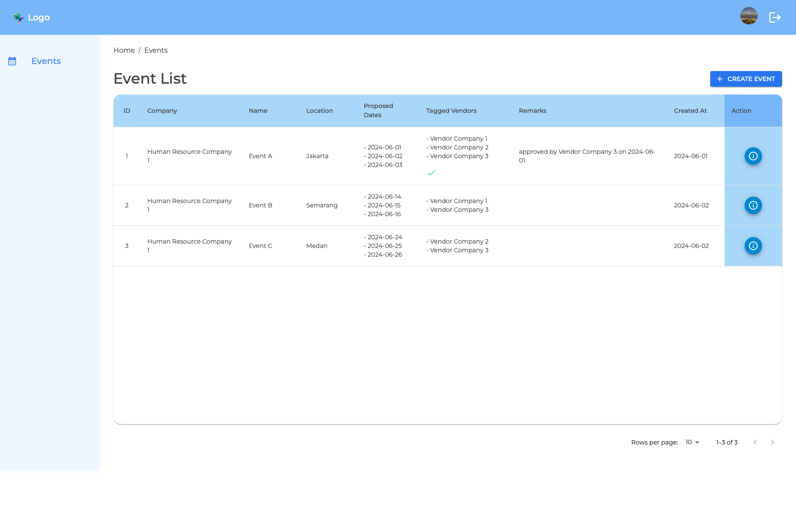
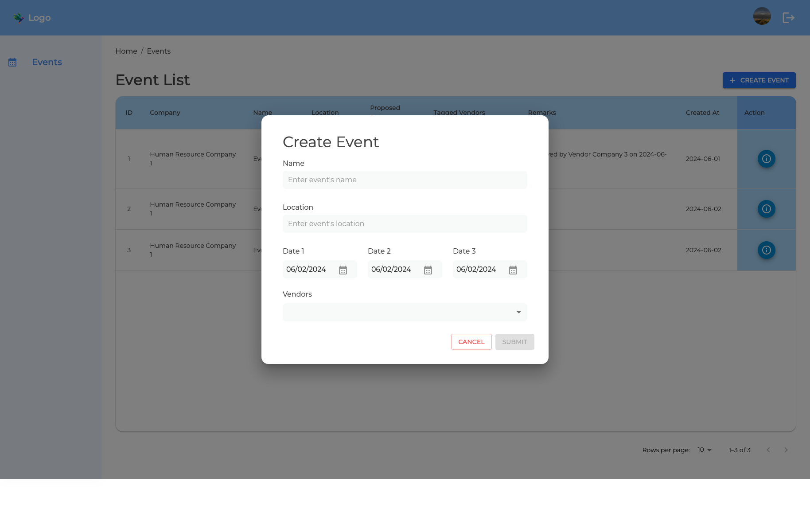
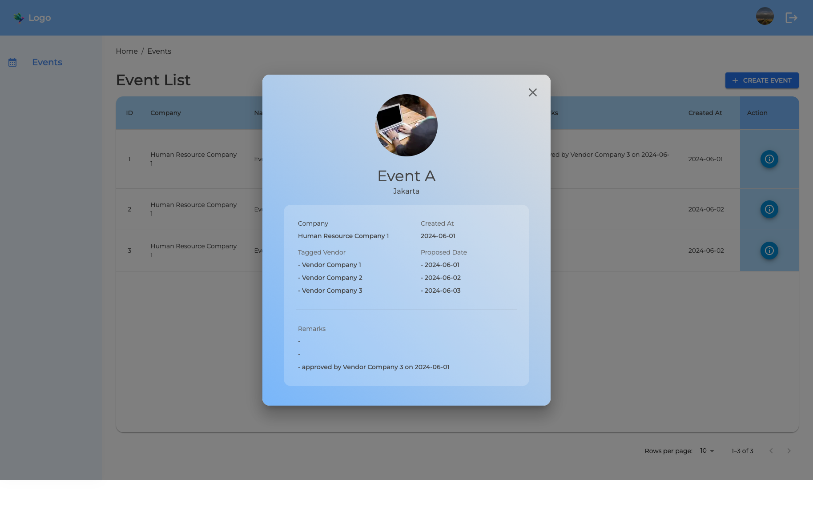
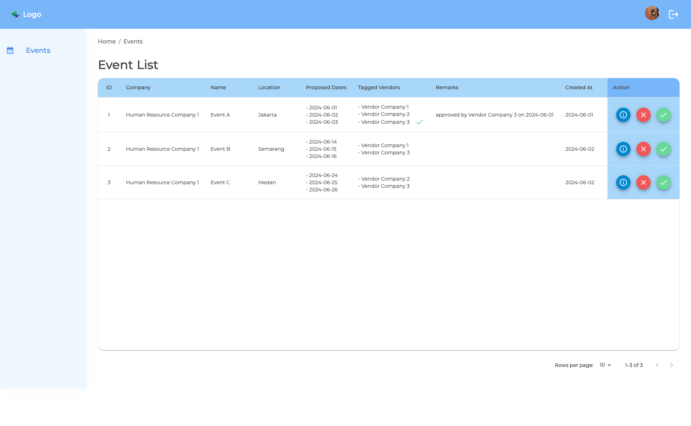
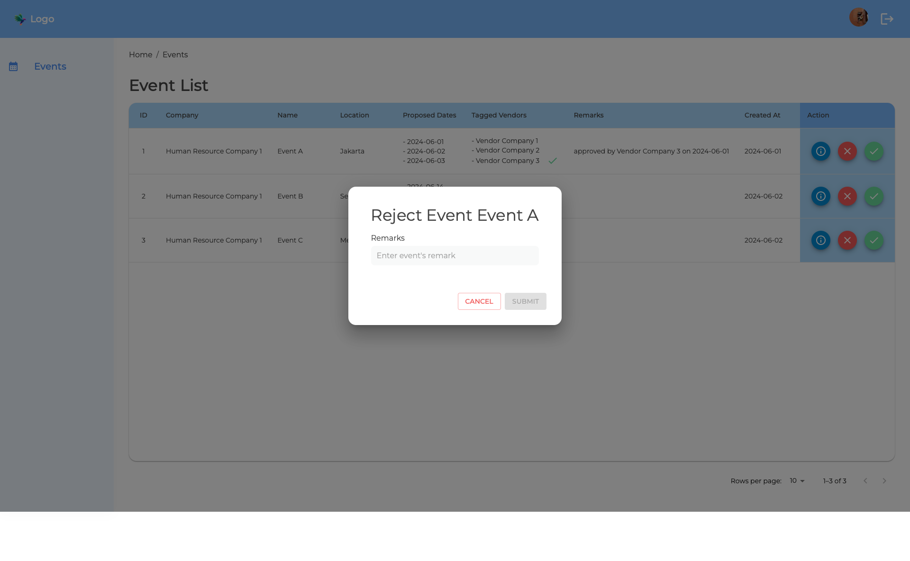
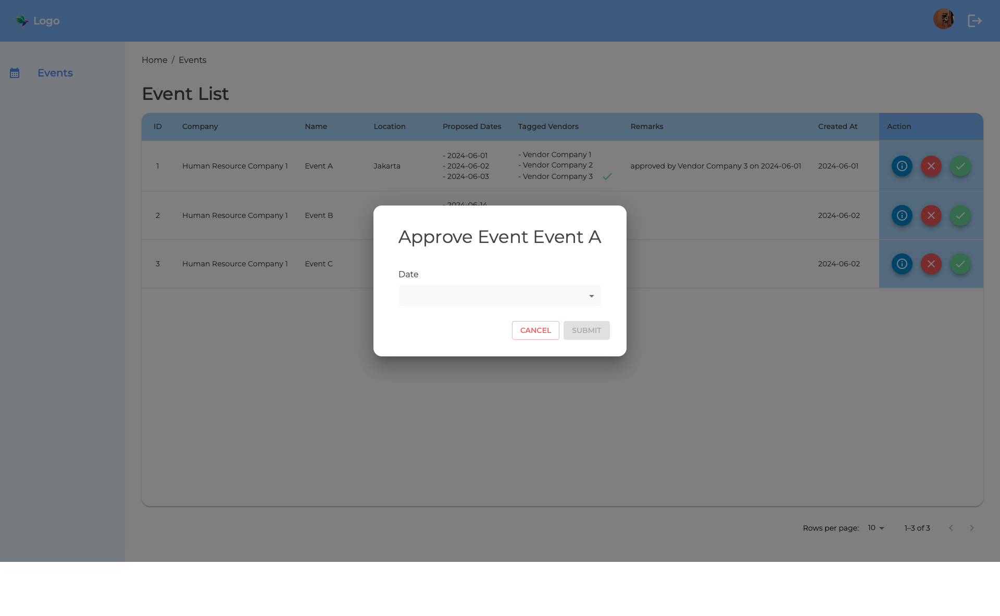

# EMBREO Frontend Test

## Table of Contents

- [Features](#features)
- [Screenshots](#screenshots)
- [Prerequisites](#prerequisites)
- [Installation](#installation)
- [Usage](#usage)

## Features

List the key features of app:

- Login with jwt verification
- Create event
- Approve event
- Reject event

## Screenshots

## Prerequisites

- Node.js (version 20.10.0)
- npm (version 10.2.3)

## Installation

How to install and set up app on local

1. Clone the repository: `git clone https://github.com/faridzam/embreo-frontend-test.git`
2. Navigate to the project directory: `cd embreo-frontend-test`
3. Install dependencies: `npm install`

## Usage

- To start the app in development mode: `npm run dev`
- To build the app: `npm run build`
- To run the app: `npm run preview`
- To run prettier : `npm run format`